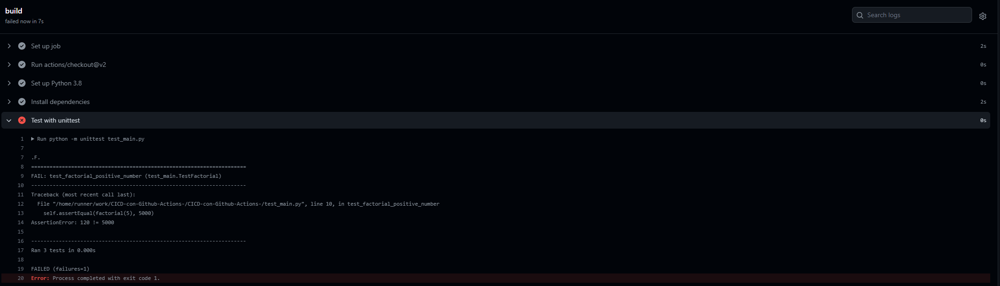
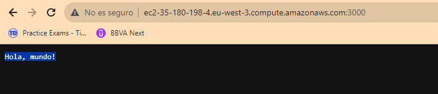
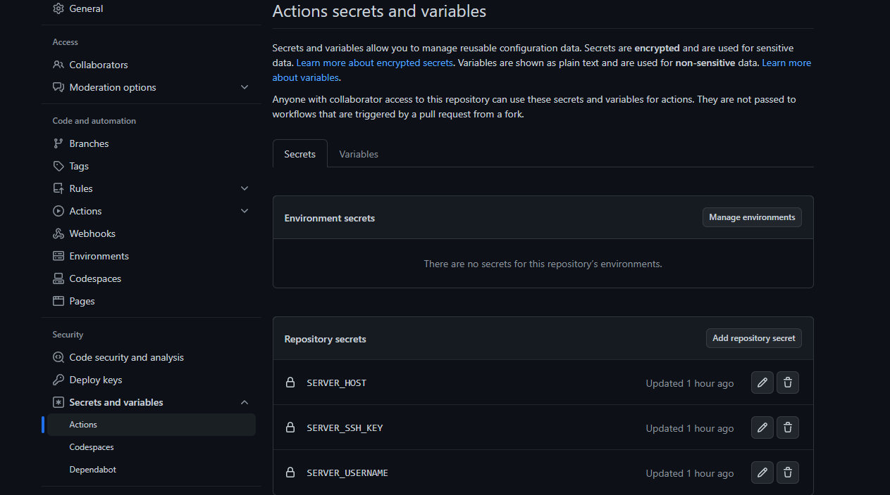
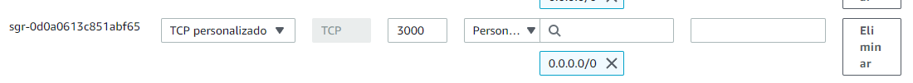
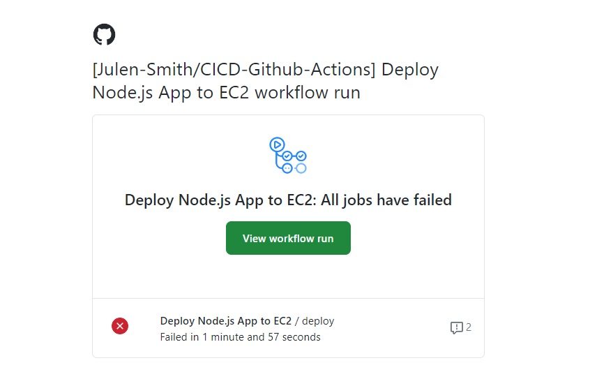

# CICD-Github-Actions

Casi lo mismo que Jenkins

## Código

El código, es un código simple de unas pruebas unitarias donde se comprueba que el número factorial devuelto es correcto y que se controla el error de input.
>Factorial

## Pruebas

# Parte CI
En esta parte de integración continua lo único que vamos a generar es que cuando hagamos un push en una maquina ubuntu se lance nuestra clase de pruebas o cualquier script que controle la calidad del codigo (al menos ese es el fin).
Quizá este sea no sea el mejor ejemplo, pero se podría que generar que se pase algún programa como Sonar o la norminette de 42 para el control de lineas, formateo etc...

### python-ci.yml

Aqui lo único que estamos mencionando son las ramas que van a tener afectación y que acciones van a triggerear las pruebas.

En este caso voy a crear un job que va buildear y testear la aplicación.
Reitero en que quizá al ser una aplicación pequeña y python ser un lenguaje interpretado no sea el mejor contexto,por que la fase build generalmente viene mas ligada a la creación de un artefacto que luego se pueda ejecutar.
>Por ejemplo un .war de java o un .exe para windows o un ./mi_prog
>(Se podría crear un .exe de esta aplicación pero es un jaleo, otro día)

El tema de los uses:
Por un lado se pueden crear uses o buscar uses por aquí.
https://github.com/marketplace?type=actions

### Explicación sencilla

Normalmente para poder correr este programa en un ubuntu necesitaria hacer un sudo apt-get install python lo que sea
Vale la cosa es que yo si me genero una pipeline podría querer probar mi aplicación en distintos sistemas operativos y entonces tendría que hacer distintas operaciones para cada uno de ellos. Imagina las diferencias entre windows, macos y todas las distros de linux.
>Entonces en este use concreto actions/setup-python@v2
>Lo que me estoy facilitando es la portabilidad, la versión de python que quiero y otras muchas cosas que todavía no acabo de entender de control de entorno.

La versión con la que quiero tirar y homogenizar mis pruebas.

El resto nada, comandos necesarios ordenaditos on sus tags y por supuesto la ejecución de las pruebas.

## Resolución
### En la pestaña actions se ve que he realizado varios pusheos ya mientras generaba el readme

### Si vemos el último sin entrar en mucho detalle se ve que el Job ha corrido correctamente

### En cambio si pusheo con un error de código diciendole que compruebe que el factorial de 5 es 5000
>Casca

### Dandonos una manera bastante eficiente de saber si la hemos cagado o el código cumple un criterio minimo
sobre todo en pull request y commits antes de mergear o hacer cualquier modificación.

# Parte CD

## Código

Lo primero que he hecho ha sido generarme una nueva rama [Aws_Deploy] con un código default node.js que me permitirá imprimir un Hola mundo utilizando el puerto 3000

const http = require('http');

const hostname = '0.0.0.0';
const port = 3000;

const server = http.createServer((req, res) => {
  res.statusCode = 200;
  res.setHeader('Content-Type', 'text/plain');
  res.end('Hola, mundo!\n');
});

server.listen(port, hostname, () => {
  console.log(`Server running at http://${hostname}:${port}/`);
});

Con su package Json

{
    "name": "mi-aplicacion",
    "version": "1.0.0",
    "description": "Una aplicación de ejemplo",
    "main": "index.js",
    "scripts": {
      "start": "node index.js",
      "test": "echo \"Error: no test specified\" && exit 1",
      "build": "echo 'Ejecutando el script de build'"
    },
    "keywords": [
      "ejemplo"
    ],
    "author": "Julen Smith",
    "license": "ISC",
    "dependencies": {
      "express": "^4.17.1"
    },
    "devDependencies": {
      "nodemon": "^2.0.7"
    }
  }

### nodejs_deploy.yml

Las branches en las que voy a trabajar

name: Deploy Node.js App to EC2

on:
  push:
    branches:
      - Aws_deploy

Y los steps a utilizar

   - name: Checkout code
      uses: actions/checkout@v2

    - name: Setup Node.js
      uses: actions/setup-node@v2
      with:
        node-version: '14'

    - name: Install dependencies
      run: npm install

    - name: Build
      run: npm run build

    - name: Create .ssh directory
      run: mkdir -p ~/.ssh

En esta parte he utilizado github secrets para las claves ssh como la ip publica

Volcado de datos de la pem que suelen dar para la conexion ssh
    - name: Add SSH key to agent
      run: |
        echo "${{ secrets.SERVER_SSH_KEY }}" > key.pem
        chmod 400 key.pem
        eval "$(ssh-agent -s)"
        ssh-add key.pem

Y el deploy con alguna traza para ir viendo donde casca

    - name: Deploy to server
      run: |
        ssh -i key.pem ${{ secrets.SERVER_USERNAME }}@${{ secrets.SERVER_HOST }} "\
        sudo apt-get update -y && \
        sudo apt-get upgrade -y && \
        sudo apt-get autoremove -y && \
        sudo apt-get autoclean && \
        sudo apt-get -f install && \
        sudo dpkg --configure -a && \
        sudo apt-get purge -y nodejs npm && \
        curl -sL https://deb.nodesource.com/setup_14.x | sudo -E bash - && \
        sudo apt-get install -y git nodejs || exit 1; \
        cd ~ && \
        if [ ! -d \"CICD-Github-Actions\" ]; then \
          git clone https://github.com/Julen-Smith/CICD-Github-Actions.git || exit 1; \
        fi && \
        cd CICD-Github-Actions && \
        git checkout Aws_deploy || exit 1 && \
        npm install || exit 1 && \
        sudo npm install -g pm2 || exit 1 && \
        pm2 restart all || pm2 start app.js || exit 1"

Importante añadir también el puerto en el que voy a servir la conexión

Despues de varios fallos por configuraciones de node y versiones deprecadas (culpa mia (También es la primera vez con Github Actions por mucho que se parezca a Jenkins))

 

Success

Obteniendo que después de cada pusheo, la aplicacion se va a lanzar en la instancia EC2 automaticamente.

