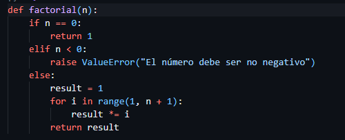
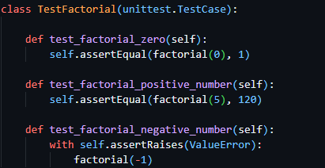
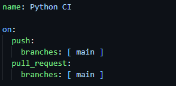
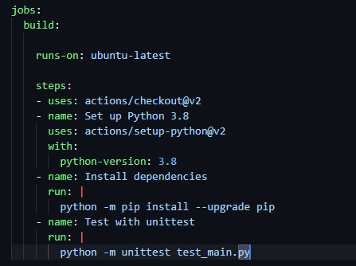
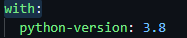
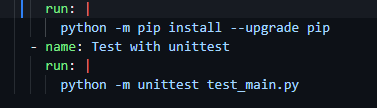
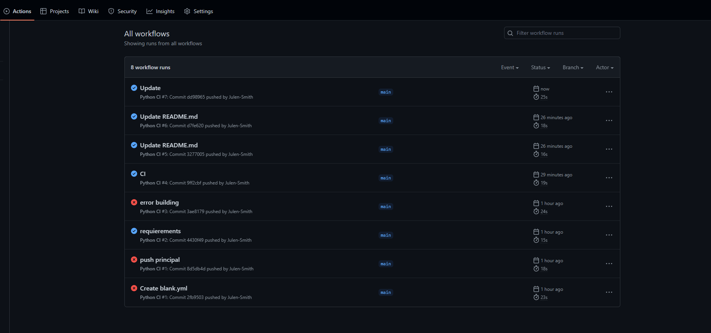
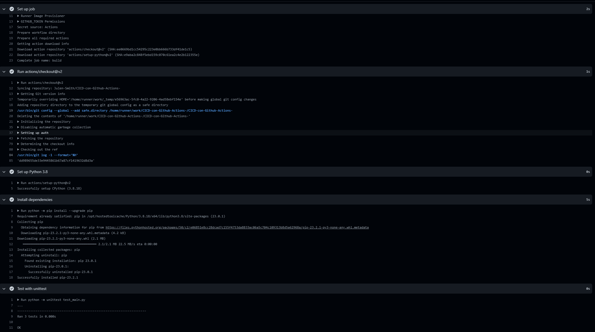

# CICD-con-Github-Actions-

Casi lo mismo que Jenkins

## Código

El código, es un código simple de unas pruebas unitarias donde se comprueba que el número factorial devuelto es correcto y que se controla el error de input.
Factorial

## Pruebas Pruebas

# Parte CI
En esta parte de integración continua lo único que vamos a generar es que cuando hagamos un push en una maquina ubuntu se lance nuestra clase de pruebas o cualquier script que controle la calidad del codigo (al menos ese es el fin).
Quizá este sea no sea el mejor ejemplo, pero se podría que generar que se pase algún programa como Sonar o la norminette de 42 para el control de lineas, formateo etc...

### python-ci.yml

Aqui lo único que estamos mencionando son las ramas que van a tener afectación y que acciones van a triggerear las pruebas.

En este caso voy a crear un job que va buildear y testear la aplicación.
Reitero en que quizá al ser una aplicación pequeña y python ser un lenguaje interpretado no sea el mejor contexto,por que la fase build generalmente viene mas ligada a la creación de un artefacto que luego se pueda ejecutar.
Por ejemplo un .war de java o un .exe para windows o un ./mi_prog
(Se podría crear un .exe de esta aplicación pero es un jaleo, otro día)

El tema de los uses:
Por un lado se pueden crear uses o buscar uses por aquí.
https://github.com/marketplace?type=actions

### Explicación sencilla

Normalmente para poder correr este programa en un ubuntu necesitaria hacer un sudo apt-get install python lo que sea
Vale la cosa es que yo si me genero una pipeline podría querer probar mi aplicación en distintos sistemas operativos y entonces tendría que hacer distintas operaciones para cada uno de ellos. Imagina las diferencias entre windows, macos y todas las distros de linux.
Entonces en este use concreto actions/setup-python@v2
Lo que me estoy facilitando es la portabilidad, la versión de python que quiero y otras muchas cosas que todavía no acabo de entender de control de entorno.

La versión con la que quiero tirar y homogenizar mis pruebas

El resto nada, comandos necesarios ordenaditos on sus tags y por supuesto la ejecución de las pruebas.

Resolución
En la pestaña actions se ve que he realizado varios pusheos ya mientras generaba el readme

Si vemos el último sin entrar en mucho detalle se ve que el Job ha corrido correctamente

En cambio si pusheo con un error de código diciendole que compruebe que el factorial de 5 es 5000
Casca

Dandonos una manera bastante eficiente de saber si la hemos cagado o el código cumple un criterio minimo
sobre todo en pull request y commits antes de mergear o hacer cualquier modificación.

# Parte CD

Terminar y pushear la parte cd , dejo pendiente.

